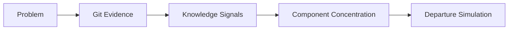

# Engineering Continuity Lab

An evidence-driven experiment for understanding where engineering knowledge is concentrated and what may happen when a key contributor leaves.

Engineering Continuity Lab analyzes local Git history. It makes evidence, assumptions, and limitations visible so teams can begin a continuity conversation from something concrete—not from a claim that Git can measure human knowledge.

## Live Demo

<https://engineering-continuity-labs.github.io/engineering-continuity-lab/>

The public demo opens with synthetic data. You can load a compatible local JSON report; it remains only in browser memory and is never uploaded or persisted. The source and methodology are available in this repository. Maintainers can find deployment details in [GitHub Pages demo](docs/github-pages.md).



## What it does

For directory-based components, the tool calculates contributor score shares, concentration, and a LOW, MEDIUM, HIGH, or CRITICAL risk classification. It then models the impact of removing a contributor, including historical file coverage and an overlap-based successor candidate.

The browser report explorer displays component concentration, contributor evidence, and Continuity Stress Test scenarios. Run it through the local loopback service to analyze a repository path directly, or open an existing `analyze` JSON report. It does not upload or persist reports.

## Install and run

Requires Python 3.12+ and Git. The runtime has no third-party Python dependencies.

```sh
python3.12 -m venv .venv
. .venv/bin/activate
python -m pip install -e .

continuity analyze --repo /path/to/repository
continuity person "contributor@example.com" --repo /path/to/repository
continuity simulate-departure "contributor@example.com" --repo /path/to/repository
continuity analyze --repo https://github.com/psf/requests.git
```

`analyze` emits the complete report. `person` returns the selected contributor’s evidence by component. `simulate-departure` returns the components most affected by that contributor’s modeled departure.

Public HTTPS Git clone URLs are also supported. The tool performs a full temporary clone, analyzes its complete history, and removes the clone after the command completes. Private repository authentication, URL credentials, SSH URLs, and persistent repository caching are not supported yet.

```text
continuity analyze

Engineering Continuity Lab

Repository path or clone URL:

> https://github.com/psf/requests.git
```

Use `--format text` for readable terminal tables. JSON is the default and is the input for the report explorer.

```sh
continuity analyze --repo /path/to/repository --component-depth 2 --format text
continuity analyze --repo /path/to/repository --exclude-bots --exclude-generated > report.json
continuity explorer
```

Open `http://127.0.0.1:8765`, enter a local Git repository path, and select **Analyze repository**. The service binds only to `127.0.0.1`; it does not clone repositories or contact GitHub. The interface starts with clearly labelled synthetic data, never a private report. Reports remain in browser memory and are cleared on reload. The maximum report file size is 30 MB.

## Evidence, inference, and unknowns

| Measured Git evidence | Inferred knowledge proxy | What the model cannot know |
| --- | --- | --- |
| commits, canonical authors, author dates, changed paths, additions/deletions where Git provides them | relative contribution share, recency, breadth, persistence, component concentration, and modeled loss | actual understanding, quality, availability, role, pairing, review depth, undocumented knowledge, operational experience, or replacement readiness |

The six transparent signals are change ownership, recency, change frequency, code-area breadth, unique contribution, and historical persistence. Configurable weights combine them into a relative contributor score per component. Concentration uses the Herfindahl index of those shares.

Git activity is only a proxy for knowledge. Scores are experimental, are not measures of ability or productivity, and must not be used to assess people. A departure “loss” is a pre-departure score share, not an estimate of irreplaceable knowledge. Review evidence with the team before making continuity decisions.

## Filters and scope

All tracked historical paths count by default, including deleted files, generated code, vendored files, tests, and documentation. Filtering is explicit and recorded in the report:

```sh
continuity analyze --repo /path/to/repository --component-depth 2 --format text \
  --exclude-bots --exclude-generated \
  --exclude-path 'vendor/*' --exclude-author 'automation@example.com'
```

- `--exclude-bots` matches the literal `[bot]` marker in the canonical author name or email.
- `--exclude-generated` matches a deliberately narrow filename heuristic: `*.g.cs`, `*.g.i.cs`, `*.generated.*`, `*.min.js`, and `*.min.css`.
- `--exclude-path GLOB` and `--exclude-author GLOB` are repeatable. Quote globs to prevent shell expansion.

The tool flags shallow clones because their history is incomplete. Renames are represented as deletion plus addition; semantic file identity is not inferred. Bot filtering and generated-file filtering can change a classification, so compare filtered and unfiltered reports rather than assuming a filtered result is more accurate.

## Architecture

```mermaid
flowchart LR
    CLI[CLI] --> Git[Git history provider]
    Git --> Domain[Immutable domain evidence]
    Domain --> Filters[Explicit evidence filters]
    Filters --> Components[Replaceable component strategy]
    Components --> Scoring[Pure scoring model]
    Scoring --> Analysis[Concentration and departure analysis]
    Analysis --> JSON[JSON / text report]
    JSON --> Explorer[Local browser explorer]
```



The provider-independent domain model, component strategy protocol, and pure scoring functions keep later evidence sources separate from Git extraction. See [architecture](docs/architecture.md) and the complete [scoring model](docs/scoring-model.md).

## Real-world validation

The baseline was validated against a full local clone of [dotnet/eShop](https://github.com/dotnet/eShop) at revision `b4a40872005d4bb29e5b1fa1ff7e244143d39215`. At directory depth 2, the run analyzed 347 commits, 59 contributors with changed-file evidence, and 48 components: 33 LOW, 10 MEDIUM, and 5 CRITICAL. The validation clone and generated reports are not committed to this repository.

Those classifications describe historical Git activity concentration only. They do not establish who understands an area. Reproduce the result and read the limitations in [validation](docs/validation.md).

## Development

```sh
python -m unittest discover -s tests -v
python -m mypy --strict src
node --test ui/tests/model.test.js
node --check ui/dist/app.js
node --check ui/dist/model.js
```

## Roadmap

- **v0.1** Git knowledge-risk baseline
- **v0.2** PR/review evidence
- **v0.3** Azure DevOps traceability
- **v0.4** Requirements, test, and architecture evidence
- **v0.5** Technical handover verification

## Spec-driven development

Specifications are the source of truth for observable behavior. Documentation explains architecture, rationale, usage, and validation evidence; source implements the specifications; tests provide verification evidence.

Read the [governance process](specs/README.md), [v0.1 product specification](specs/v0.1/product-spec.md), [normative scoring contract](specs/v0.1/scoring-spec.md), [acceptance criteria](specs/v0.1/acceptance-criteria.md), and [traceability matrix](specs/v0.1/traceability.md). Future roadmap work begins with specifications before implementation: v0.2 PR/review evidence, v0.3 Azure DevOps traceability, v0.4 requirements/test/architecture evidence, and v0.5 technical handover verification.

## License

Licensed under the [Apache License 2.0](LICENSE).
