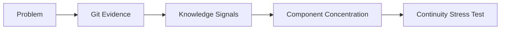

# Engineering Continuity Lab

An evidence-driven experiment for understanding where engineering evidence is concentrated and how resilient software components are to that concentration.

Engineering Continuity Lab analyzes local Git history. It makes evidence, assumptions, and limitations visible so teams can begin a continuity conversation from something concrete—not from a claim that Git can measure human knowledge.

## Live Demo

<https://engineering-continuity-labs.github.io/engineering-continuity-lab/>

The public demo opens with a static analysis report for [dotnet/eShop](https://github.com/dotnet/eShop) at the documented validation revision. It is historical Git evidence only, packaged with this site; it does not clone or contact eShop. You can load a compatible local JSON report, which remains only in browser memory and is never uploaded or persisted. The source and methodology are available in this repository. Maintainers can find deployment details in [GitHub Pages demo](docs/github-pages.md).


```mermaid
flowchart LR
    A[Problem] --> B[Git Evidence]
    B --> C[Knowledge Signals]
    C --> D[Component Concentration]
    D --> E[Continuity Stress Test]
```

## What it does

For directory-based components, the tool calculates contributor score shares, component concentration, and a LOW, MEDIUM, HIGH, or CRITICAL continuity-risk classification. It applies contributor scenarios to explore evidence impact, coverage gaps, and historical evidence overlap. Historical evidence overlap is not a recommendation that one contributor can replace another.

The browser report explorer displays component concentration, contributor evidence, and Continuity Stress Test scenarios. Run it through the local loopback service to analyze a repository path directly, or open an existing `analyze` JSON report. It does not upload or persist reports.

## Install and run

Requires Python 3.12+ and Git. The runtime has no third-party Python dependencies.

```sh
python3.12 -m venv .venv
. .venv/bin/activate
python -m pip install -e .

continuity analyze --repo /path/to/repository
continuity person "contributor@example.com" --repo /path/to/repository
continuity simulate-departure "contributor@example.com" --repo /path/to/repository # compatibility CLI command
continuity analyze --repo https://github.com/psf/requests.git
```

`analyze` emits the complete report. `person` returns contributor evidence by component. The backward-compatible `simulate-departure` command returns Continuity Stress Test evidence for a contributor scenario.

Public HTTPS Git clone URLs are also supported. The tool performs a full temporary clone, analyzes its complete history, and removes the clone after the command completes. Private repository authentication, URL credentials, SSH URLs, and persistent repository caching are not supported yet.

```text
continuity analyze

Engineering Continuity Lab

Repository path or clone URL:

> https://github.com/psf/requests.git
```

Use `--format text` for readable terminal tables. JSON is the default and is the input for the report explorer.

```sh
continuity analyze --repo /path/to/repository --component-depth 2 --format text
continuity analyze --repo /path/to/repository --exclude-bots --exclude-generated > report.json
continuity explorer
```

Start with the local explorer for the normal workflow:

```sh
continuity explorer
```

It opens a loopback-only browser interface where you can analyze either a local Git repository path or a public HTTPS clone URL. The report appears immediately in the browser; exporting JSON is optional for sharing or reopening later. A public URL is cloned temporarily with full history and removed when analysis completes. You can also start with a source already selected:

```sh
continuity explorer --repo /path/to/repository
continuity explorer --repo https://github.com/psf/requests.git
```

The service binds only to `127.0.0.1`. Reports remain in browser memory and are cleared on reload. The maximum imported report file size is 30 MB.

## Evidence, inference, and unknowns

| Measured Git evidence | Inferred knowledge proxy | What the model cannot know |
| --- | --- | --- |
| commits, canonical authors, author dates, changed paths, additions/deletions where Git provides them | relative contribution share, recency, breadth, persistence, component concentration, and scenario evidence impact | actual understanding, quality, availability, role, pairing, review depth, undocumented knowledge, operational experience, or technical handover readiness |

The six transparent signals are change ownership, recency, change frequency, code-area breadth, unique contribution, and historical persistence. Configurable weights combine them into a relative contributor score per component. Concentration uses the Herfindahl index of those shares.

Git activity is only a proxy for knowledge. Scores are experimental, are not measures of ability or productivity, and must not be used to assess people. Scenario evidence impact is derived from historical contribution evidence; it is not an estimate of irreplaceable knowledge, expertise, or staffing readiness. Review evidence with the team before making continuity decisions.

## Filters and scope

All tracked historical paths count by default, including deleted files, generated code, vendored files, tests, and documentation. Filtering is explicit and recorded in the report:

```sh
continuity analyze --repo /path/to/repository --component-depth 2 --format text \
  --exclude-bots --exclude-generated \
  --exclude-path 'vendor/*' --exclude-author 'automation@example.com'
```

- `--exclude-bots` matches the literal `[bot]` marker in the canonical author name or email.
- `--exclude-generated` matches a deliberately narrow filename heuristic: `*.g.cs`, `*.g.i.cs`, `*.generated.*`, `*.min.js`, and `*.min.css`.
- `--exclude-path GLOB` and `--exclude-author GLOB` are repeatable. Quote globs to prevent shell expansion.

The tool flags shallow clones because their history is incomplete. Renames are represented as deletion plus addition; semantic file identity is not inferred. Bot filtering and generated-file filtering can change a classification, so compare filtered and unfiltered reports rather than assuming a filtered result is more accurate.

## Architecture


```mermaid
flowchart LR
    CLI[CLI] --> Git[Git history provider]
    Git --> Domain[Immutable domain evidence]
    Domain --> Filters[Explicit evidence filters]
    Filters --> Components[Replaceable component strategy]
    Components --> Scoring[Pure scoring model]
    Scoring --> Analysis[Concentration and continuity analysis]
    Analysis --> JSON[JSON / text report]
    JSON --> Explorer[Local browser explorer]
```

The provider-independent domain model, component strategy protocol, and pure scoring functions keep later evidence sources separate from Git extraction. See [architecture](docs/architecture.md) and the complete [scoring model](docs/scoring-model.md).

## Real-world validation

The baseline was validated against a full local clone of [dotnet/eShop](https://github.com/dotnet/eShop) at revision `b4a40872005d4bb29e5b1fa1ff7e244143d39215`. At directory depth 2, the run analyzed 347 commits, 59 contributors with changed-file evidence, and 48 components: 33 LOW, 10 MEDIUM, and 5 CRITICAL. The validation clone is not committed; the Pages site packages the resulting Git-evidence report as its static sample, without eShop source code.

Those classifications describe historical Git activity concentration only. They do not establish who understands an area. Reproduce the result and read the limitations in [validation](docs/validation.md).

## Development

```sh
python -m unittest discover -s tests -v
python -m mypy --strict src
node --test ui/tests/model.test.js
node --check ui/dist/app.js
node --check ui/dist/model.js
```

## Roadmap

- **v0.1** Git engineering-continuity baseline
- **v0.2** Provider-independent merged PR and review evidence: review coverage, reviewer concentration, and separate authorship-versus-review comparison
- **v0.3** Artifact traceability is implemented: [offline paths/gaps/coverage](docs/offline-traceability.md), [report v3](docs/report-schema-v3.md), and a read-only [Azure DevOps provider](docs/azure-devops-provider.md) with Server current/7.2, Server2022.1/7.1, Server2022/7.0 and Services/7.2 target profiles. Synthetic REST validation and runtime-only PAT transport are implemented. A [local acquisition CLI](docs/azure-local-connection.md) accepts explicit non-secret TOML configuration and a hidden runtime PAT. Real deployment compatibility certification, Azure explorer integration and OAuth/NTLM/Kerberos remain deferred; validated reports can now be inspected in the [Traceability Explorer](docs/traceability-explorer.md); the package stays at 0.2.0 until v0.3 release preparation.
- **v0.4** [Requirements, test and architecture evidence design](specs/v0.4/product-spec.md): explicit versioned associations and qualified historical verification outcomes; first runtime increment planned offline. No implementation/release claimed.
- **v0.5** Technical handover verification

## Spec-driven development

Specifications are the source of truth for observable behavior. Documentation explains architecture, rationale, usage, and validation evidence; source implements the specifications; tests provide verification evidence.

Read the [governance process](specs/README.md), [v0.1 product specification](specs/v0.1/product-spec.md), [normative scoring contract](specs/v0.1/scoring-spec.md), [acceptance criteria](specs/v0.1/acceptance-criteria.md), and [traceability matrix](specs/v0.1/traceability.md). v0.2 PR/review evidence is implemented; verification is mapped in [v0.2 traceability](specs/v0.2/traceability.md). The [v0.3 specification and traceability matrix](specs/v0.3/traceability.md) map implemented core, report and Azure-provider behavior to synthetic evidence. Remaining v0.3 Azure explorer integration/live validation work and future v0.4/v0.5 changes require their own specification-driven handoffs.

## License

Licensed under the [Apache License 2.0](LICENSE).

## v0.2 PR and review evidence

The local explorer optionally collects public GitHub review evidence, separately from unchanged Git contribution scoring. It follows actual REST next links for closed PRs, changed files, and reviews, retaining merged PRs only. The boundary is all reachable public pages, with a 1000-page safety limit per endpoint and GitHub's changed-file ceiling handled conservatively. No token or authentication is needed or supported. API failures/rate limits retain usable evidence as PARTIAL; an interruption without usable PR evidence is FAILED. Missing review evidence means unavailable, not zero reviews.

Review-capable reports add `report_version: "2.0"`; `model: "experimental-v0.1"` continues to identify unchanged Git scoring. Existing Git-only JSON remains valid. Export Analysis Report downloads the entire validated report; reopening it retains review provenance, completeness, events, coverage and concentration. Invalid review structures are rejected.

The [static demo](https://engineering-continuity-labs.github.io/engineering-continuity-lab/) bundles a normalized, explicitly PARTIAL eShop snapshot and makes no GitHub API requests. Its Git baseline remains at the documented fixed revision; review evidence has a separate collection time/boundary. See [collection results](docs/validation/eshop-v0.2-summary.json), [design](docs/review-evidence.md), and [completion evidence](docs/validation/v0.2-completion.md). To repeat the manual public run from a source checkout: `python scripts/validate_eshop_reviews.py`. That command refreshes the bundled normalized snapshot and summary; public rate limits may prevent completion.

## v0.3 Traceability, Report v3 and Azure Provider

The merged core derives typed Work Item → PR → Commit → Changed Path → Component paths, qualified gaps and distinct artifact coverage from normalized evidence. Report v3 adds optional `traceability_evidence` while retaining `model: "experimental-v0.1"` and existing Git/review sections. Python and browser consumers validate and round-trip typed relationships, supports, status and coverage semantics.

The read-only Azure provider independently acquires completed PRs, project work items and fixed-revision commit ancestry. It maps explicit provider associations and optional commit changes into `TraceabilityEvidenceCollection`; existing `derive()` produces `TraceabilityReport`, then report-v3 serialization feeds browser validation/import/export. No links are inferred from titles or messages. Server current/7.2 is the primary target profile, with Server2022.1/7.1, Server2022/7.0 and Services/7.2 profiles and bounded explicit overrides. PAT support is runtime-only in transport; native addresses/IDs are separated from approved public aliases.

Project-owned SYNTHETIC Azure-shaped responses validate this pipeline, including loopback HTTP. **Real Azure Server/Services compatibility remains MANUAL until tested in a dedicated non-sensitive live environment.** The normal Git explorer does not acquire Azure evidence automatically. The [local connection CLI](docs/azure-local-connection.md) emits a standalone report-v3 traceability section; browser/explorer connection integration, OAuth/NTLM/Kerberos remain deferred; validated reports can now be inspected in the [Traceability Explorer](docs/traceability-explorer.md). Package version 0.2.0 and releases v0.1.0/v0.2.0 remain unchanged; v0.3 is implemented in increments and has not been released.

See [provider usage and limits](docs/azure-devops-provider.md), [offline traceability](docs/offline-traceability.md), [report-v3 schema](docs/report-schema-v3.md), [traceability matrix](specs/v0.3/traceability.md), [independent provider review](docs/validation/v0.3-azure-provider-review.md) and [closure verification](docs/validation/v0.3-closure-verification.md).
