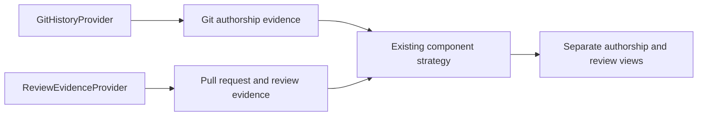

# v0.2 review-evidence design

## Decision

v0.2 introduces a provider-independent review-evidence boundary alongside, rather than inside, the existing `HistoryProvider`. Git history and PR/review evidence describe different sources and have different retrieval, completeness, and provenance semantics. They meet only after paths are mapped through the existing component strategy.

No domain object in this boundary contains GitHub REST, GraphQL, or Azure DevOps DTOs. The GitHub adapter translates provider payloads at its edge; an Azure DevOps adapter must be able to populate the same domain contract.

## Provider-independent domain contract

The domain layer uses immutable value objects equivalent to these concepts:

| Concept | Required information | Notes |
| --- | --- | --- |
| `ProviderReference` | provider key, public repository reference, provider object identifier | Repository references must be credential-free. |
| `PullRequestEvidence` | reference, author identity, merged timestamp, changed paths, reviews | A PR is accepted only when required fields are structurally valid. |
| `ChangedPath` | repository-relative path | Maps through the existing `ComponentStrategy`; provider-specific file records stay at the adapter edge. |
| `ReviewEvidence` | provider review-event identifier, reviewer identity where supplied, state, timestamp where supplied, dismissal metadata where supplied, ordering metadata | Retains event history; it is not pre-collapsed by the adapter. |
| `ReviewState` | APPROVED, CHANGES_REQUESTED, COMMENTED, plus explicit provider-unknown/other state | Known states remain distinct. |
| `Reviewer` | stable identity, optional display name, provider-declared bot flag when supplied | No team or employment inference. |
| `ReviewEvidenceCollection` | items, provenance, completeness, diagnostics | Distinguishes COMPLETE, PARTIAL, and FAILED collection outcomes. |

`ReviewEvidenceProvider.acquire(request)` should return `ReviewEvidenceCollection`, not `History`. The request contains a public repository reference and an explicit boundary/configuration. It must not accept or emit credentials as data. A provider adapter validates and normalizes at its edge before creating domain evidence.

## Data flow and derivation

1. Acquire merged PR evidence and collection provenance from `ReviewEvidenceProvider`.
2. Validate required PR/provider identity, merge time, author, and changed paths. Isolate invalid records in diagnostics rather than invent values.
3. Deduplicate provider review events by provider event identifier.
4. Retain all events and derive one effective review per reviewer/PR according to the v0.2 state-transition ordering contract.
5. Map each distinct changed path with the existing component strategy. A multi-component PR is represented once per component.
6. Apply the documented qualification policy to effective reviews. Preserve non-qualifying evidence and reasons.
7. Derive review coverage, reviewer distribution, reviewer HHI, unreviewed merged PR references, and an authorship-versus-review comparison view.

The review aggregation must not mutate Git evidence or invoke v0.1 scoring. The report adds a versioned `review_evidence` section while preserving every existing Git field.

## Implemented public-provider boundary

The local explorer uses a public GitHub REST adapter for GitHub repository URLs or local repositories with a GitHub `origin` remote. It traverses public closed-PR, changed-file, and review-event pages in order until collection completes, a safety limit is reached, or the public API prevents continuation. Uncollected evidence is explicitly `PARTIAL`; a provider failure before useful evidence is collected is `FAILED`. No token, authentication header, raw provider payload, URL query, fragment, or user-info is accepted into the evidence contract.

On 2026-10-07 at 16:35:19 UTC (19:35:19 Europe/Istanbul), the completed public `dotnet/eShop` adapter inspected 100 closed PRs, observed 9 merged PRs, and retained 6 merged PRs with 24 review events and 5 qualifying effective reviews across 7 components. A provider continuation failure and public rate limit prevented completion: the collection and every component are PARTIAL. Counts describe collected records only; they are not the complete repository history. See `docs/validation/eshop-v0.2-summary.json` and the normalized static `ui/dist/eshop-reviews.js`. The Git baseline remains independent.

## Qualification, coverage, and concentration

An effective APPROVED or CHANGES_REQUESTED review by an identified, non-author, provider-non-bot reviewer qualifies. COMMENTED remains an observed event but does not qualify. An effective event marked dismissed by the provider does not qualify. Missing reviewer identities and unknown states remain explicit non-qualifying evidence.

Review coverage is PR-level within each component, not file-line coverage: each distinct merged PR mapped to a component appears once in the denominator; it appears in the numerator when it has at least one qualifying reviewer. This is a readable measure of provider-recorded review exposure, not a claim that every changed line was reviewed.

Reviewer distribution counts one unit per qualifying `(component, pull request, reviewer)`. The reviewer HHI is calculated only over these units. The review threshold configuration is a distinct v0.2 contract, even though its initial bands use familiar labels. A component with no qualifying units is `UNAVAILABLE`; classifying it LOW would be misleading.

## Comparison boundary

Authorship concentration comes from existing Git analysis. Review concentration and coverage come from the review evidence collection. A comparison requires compatible component naming and component-depth configuration. It must render source boundaries independently: a fixed Git revision and a provider collection boundary may represent different historical windows.

The comparison can describe concentration patterns, such as HIGH authorship/LOW review. It must not combine values into a person score, declare a continuity outcome, or infer expertise or replacement readiness.

## Failure, privacy, and security boundaries

- A provider transport or authorization failure is a failed collection, not an empty review result.
- A provider-declared partial response is PARTIAL; coverage and unreviewed counts carry that status.
- Missing optional display names or timestamps do not discard otherwise valid evidence. Missing required identifiers, merge status, or paths isolate a record and record diagnostics.
- Provider raw payloads, access tokens, authorization headers, secrets, credential-bearing URLs, and local temporary paths do not cross into core domain values, reports, logs, or user-facing errors.
- Store normalized minimum evidence and audit provenance only. Do not retain comment bodies, sentiment, or unrelated personal profile fields.

## Validation strategy

dotnet/eShop is the primary v0.2 validation repository because it anchors comparison to the v0.1 baseline. Its v0.2 provider collection must record public repository reference, retrieval timestamp, selected merged-PR boundary, page/completeness status, and provider limitations. The v0.1 revision `b4a40872005d4bb29e5b1fa1ff7e244143d39215` remains a documented Git baseline, but provider PR/review evidence may not be meaningfully restricted to that revision.

If eShop lacks a required public edge case, one additional public repository may be used only after the missing case and repository choice are documented. It supplements rather than replaces eShop.

## Planned QA verification

Implementation must begin with provider-neutral fixtures, then provider-adapter integration fixtures. The required cases are: one PR with several reviewers; several PR authors in one component; APPROVED, CHANGES_REQUESTED, and COMMENTED states; repeated events by one reviewer; self-review; a PR touching several components; no reviews; only non-qualifying reviews; equal reviewer shares; duplicate provider events; missing optional timestamps and display names; bot identities; dismissed and historical state transitions; deterministic order; empty review evidence; malformed and partial responses; provider failure; unchanged v0.1 Git-only reports; and the documented dotnet/eShop collection run.

QA must separately assert:

- effective state and qualification decisions, including their visible exclusion reasons;
- PR-level coverage numerator/denominator rather than file-line coverage;
- reviewer-unit normalization and HHI boundary behavior;
- no reviewer concentration label for an empty qualifying population;
- no combined authorship/review person score;
- provenance/completeness propagation;
- absence of credential material and raw provider payloads in output and error fixtures.

Provider integration tests must not require private repositories, employer data, or credentials in CI. A mocked provider transport may exercise public-provider pagination, malformed records, and error semantics. The real public dotnet/eShop validation is a documented manual/integration boundary check, not a source fixture committed into this repository.

## v0.2 completion design (Solution Architect handoff)

The Git model remains `experimental-v0.1`: it identifies unchanged Git scoring. The additive envelope `report_version: "2.0"` identifies review-capable reports. A report without review evidence remains valid, including with the additive envelope. Reviews are unavailable when absent. Export serializes the whole validated report; import validates normalized provenance, retained PR/events, statuses, and derived component counts, shares, HHI, risks, and identifiers.

The adapter follows the actual GitHub Link `rel=next` target, restricted to HTTPS api.github.com, the same endpoint, and credential-free page/per_page/filter query values. Cycles and a default 1000-page per-endpoint limit stop with PARTIAL. It does not invent page numbers from a next flag. Transport results carry collected items and safe diagnostics so a later failure does not erase validated progress. PR enumeration continues into normalization even if its later page failed. A PR with some valid paths and interrupted review/file collection may survive but the entire collection and every component are PARTIAL. A PR with no usable paths cannot contribute; no inferred paths are invented. An interruption before any usable PR is FAILED; a valid empty collection is COMPLETE. GitHub's files endpoint has a 3000-file cap: reaching that ceiling is conservatively PARTIAL even without a next link.

HTTP 429 and 403 with rate-limit indicators become a fixed public-rate-limit diagnostic. Other failures receive a fixed generic diagnostic. No raw exception, body, or headers cross the adapter boundary. Required malformed records mark partiality; optional absent timestamps keep events with provider-order fallback, and malformed timestamps become unavailable with a diagnostic. Counts of closed PRs inspected and merged PRs observed are additive collection metadata for honest validation.

Public results are snapshots of reachable API history, not an atomic historical census or the v0.1 fixed revision. No token support, automatic retry/wait, or hosted API collection is introduced.

Reviewer identifiers use the same case-insensitive identity key for effective-state grouping and cross-PR unit aggregation. Conflicting duplicate event payloads at identical ordering keys are rejected by the domain; the adapter conservatively isolates provider conflicts as non-qualifying UNKNOWN events with PARTIAL status. Missing optional timestamps record fallback ordering without alone making collection incomplete. A 403 body may be inspected up to 4096 bytes solely for rate-limit indicators; no content is retained or exposed. The package release version is 0.2.0, independent of the unchanged Git scoring model identifier.

Comparison implementation handoff for ECL-FR-211: the additive review report records `component_depth` for the directory strategy. The Reviews view displays Git authorship HHI only for an exact component match with equal recorded directory depth; otherwise comparison is unavailable. Imported early review reports without depth remain valid but cannot assert compatible scope. The bundled review sample uses depth 1, whereas the fixed Git baseline uses depth 2; it must explicitly show that difference. Review exclusions and both source boundaries are visible. QA verifies compatible and incompatible comparisons using the actual renderer.

Independent review R1 returned to Solution Architect/QA: import must reconcile derived aggregates with retained normalized events, not just validate their arithmetic. For recorded directory depth, validate the exact component mapping, effective-review units, covered/mapped counts, unreviewed identifiers, and exclusions from retained PRs. For early reports without a known strategy/depth, at least reject units exceeding qualifying retained events, coverage exceeding qualifying PRs, and unreviewed identifiers that actually qualify. Public GitHub reviewer keys are case-insensitive ASCII logins. QA includes deleting retained events while preserving aggregates, altering units to an unrelated identity, changing paths/components, and effective-state overrides; all must be rejected rather than rendered as valid evidence.
