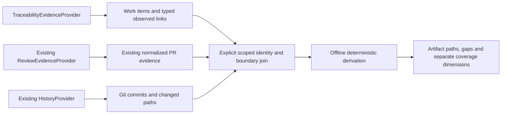

# v0.3 traceability evidence architecture — design only

**Status: proposed implementation contract for the accepted product intent; no runtime implementation.** Inputs: `specs/v0.3/product-spec.md` ECL-FR-301–328 and ECL-NFR-301–313. Existing `domain/models.py`, `domain/reviews.py`, `analysis/reviews.py`, and reporting boundaries are reused semantically. This document describes future concepts; it introduces no Python classes, adapter, persisted schema, client, UI or network calls.

## Decision D301 — separate acquisition, offline core

`TraceabilityEvidenceProvider` is separate from `ReviewEvidenceProvider` and `HistoryProvider`: work-item populations, capability completeness and artifact links have different semantics from reviews and Git history. A future adapter normalizes only the necessary observations. Pure derivation accepts immutable normalized values and the existing component strategy; it never fetches a missing artifact or authenticates.

The adapter's deployment/transport profile is separate from provenance and never exported verbatim. A fixture-backed provider is the first recommended implementation. Planned paths (not present in this PR): `domain/traceability.py`, `analysis/traceability.py`, later `traceability_providers/azure_devops.py` and a nonmutating join projection. Reuse the established COMPLETE/PARTIAL/FAILED values conceptually; moving/shared-type refactoring, if needed, must preserve v0.2 serialization and interfaces.

## Decision D302 — scoped canonical identities and minimum values

Identity is a structured tuple, not a URL, display title or provider DTO. Provider is a stable adapter family key; instance is a safe public key or stable opaque alias; scope distinguishes projects/repositories within that instance. IDs are opaque nonempty strings after documented adapter normalization. Numeric IDs become canonical decimal strings for adapters which define them as numeric; do not lowercase arbitrary native IDs. Full Git object IDs are lower-case validated algorithm-tagged hashes, never display abbreviations. Sample `commit-a` notation in examples is symbolic; executable fixture data must use valid complete hashes, e.g. 40 repeated `a` characters for a synthetic SHA-1 object ID.

| Planned immutable concept | Canonical identity / required content | Optional context and boundary |
| --- | --- | --- |
| `ProviderReference` | `(provider, instance_key, scope_key, kind, native_or_alias_id)` | Safe display label; native private mapping remains adapter-private |
| `WorkItemEvidence` | Work-item reference, normalized type/state, provenance reference | Explicitly approved title and selected timezone-aware creation/change/closed timestamps; absent is null |
| `WorkItemType` / `WorkItemState` | Type: REQUIREMENT/STORY/BUG/TASK/OTHER/UNKNOWN; state: OPEN/ACTIVE/CLOSED/OTHER/UNKNOWN | Versioned adapter mapping; unknown provider values do not invent lifecycle facts or imply implementation |
| `PullRequestReference` | Provider reference with repository scope and PR ID; pointer to existing normalized PR record when available | Merged eligibility is owned by existing PR evidence or a minimal observed status fact, not a new competing PR entity |
| `CommitReference` | `(repository_key, hash_algorithm, full_revision)` | Observation source/provenance; provider ownership does not change Git object identity |
| `ChangedPathReference` | `(commit_reference, repository_relative_path)` | Exact observed commit change, including historical/deleted paths; no path names inferred from titles |
| `ComponentReference` | `(repository_key, component_strategy_id, configuration_fingerprint, component_key)` | Existing `ComponentStrategy` output; root is `(root)` for directory strategy |
| `TraceLink` | `(typed_source, typed_target, relationship_type, origin)` plus observation reference(s) | No raw relation payload, transport URL, body or user profile |
| `TracePath` | Ordered node refs and supporting observed-link/mapping refs; derivation rule/version; compatible boundary refs | Required-hop gap records and short-path explanation; cycle-safe |
| `TraceabilityEvidenceCollection` | Work-item records, observed links, scoped lookup/capability records, provenance and COMPLETE/PARTIAL/FAILED | Valid partial progress, stable diagnostics and explicit population manifests |

Required references are structurally validated before they enter domain collections: legal kind/scope, nonempty bounded ID, no credential-bearing URL/control characters; path is repository-relative (no absolute/traversal path); timestamps require timezone if supplied. Confidential native IDs may exist transiently in the adapter, but default persisted/shared refs use safe aliases. Alias maps have a stable identifier/fingerprint and version: joining separately aliased sources requires the same mapping or an explicit approved mapping, never guessing. Cryptographic hashing alone is not a confidentiality guarantee; reverse mappings and key material never enter reports. Local transient provenance remains auditable to its authorized operator without publishing internal employer/project names.

A work item is project-scoped; a PR is repository-scoped. The same `51` in two repos or `1001` on two instances is not one object. A commit is repository-scoped even when the same hash exists elsewhere. A path at two commits is two change occurrences. A component includes strategy/configuration, so directory depth 1 and depth 2 cannot silently join.

## Decision D303 — typed observed and derived links

| Type | Legal direction | Observation basis / origin |
| --- | --- | --- |
| WI_PR | Work item → PR | Explicit provider work-item/PR association; DIRECT_PROVIDER_LINK |
| WI_COMMIT | Work item → Commit | Explicit provider commit association; DIRECT_PROVIDER_LINK |
| PR_COMMIT | PR → Commit | Provider-recorded PR membership; DIRECT_PROVIDER_LINK |
| COMMIT_PATH | Commit → Changed path | Observed Git change (DIRECT_SOURCE_LINK), or version/capability-qualified provider change observation (DIRECT_PROVIDER_LINK) |
| PR_PATH | PR → Changed-path snapshot keyed by PR | Existing v0.2 observed changed paths; DIRECT_PROVIDER_LINK; this path scope is PR-specific, not a commit occurrence |
| PATH_COMPONENT | Changed path → Component | Existing deterministic component strategy/configuration; DERIVED_LINK |
| WI_COMPONENT | Work item → Component | Derived path projection only; must reference all supporting links and rule version |

PR_PATH uses a distinct PR snapshot path reference `(PR_reference, path)` from commit-scoped `ChangedPathReference`; never convert it into COMMIT_PATH or a commit-change denominator. It supports Work Item → PR → Component as a shorter projection with the missing commit segment explicitly unresolved. Commit → Component is shorthand for COMMIT_PATH→PATH_COMPONENT, not a new direct provider statement. WI→Commit→Component is supported independently and can contribute to intent coverage without claiming a full WI→PR→Commit normative chain.

Every direct link carries provider/source, collection/observation reference, source/target scopes, relationship kind, lookup boundary, observed-at time, and sanitized observation basis (e.g. `provider_pr_work_item_association`, `provider_pr_commit_membership`, `git_commit_change`). Providers may create associations using their own mechanisms: if the API explicitly records an association, its existence is direct provider evidence; this software never derives a link just from an ID-looking string. A known schema requires a typed observed association, not a substring or arbitrary URL parse. Observation time is not relationship creation time and never establishes causality.

## Decision D304 — trace paths, duplicates and cycles

Initial path grammar is explicitly typed and finite: WI_PR→PR_COMMIT→COMMIT_PATH→PATH_COMPONENT, WI_COMMIT→COMMIT_PATH→PATH_COMPONENT, WI_PR→PR_PATH→PATH_COMPONENT, PR_COMMIT→COMMIT_PATH→PATH_COMPONENT, or COMMIT_PATH→PATH_COMPONENT. Output includes each supporting link; derived shortcuts cannot be fed back as input observations or used to manufacture paths.

Deduplication key is scoped endpoints + relationship kind + origin. Repeated identical observations count once; retain distinct sanitized provenance references sorted by canonical identity. Contradictory records with the same observation key are quarantined with PARTIAL affected scope rather than choosing by arrival order. Different endpoints with different valid observation keys are legitimate separate links. Distinct path identity is ordered supporting canonical links, never acquisition order; alternate evidenced routes are retained but counts deduplicate their endpoints/occurrences.

The legal initial relation grammar is acyclic by endpoint kind. Self-links/reverse/cyclic/unsupported provider relations are rejected as authoritative input, with bounded safe diagnostics. A defensive path walker also tracks visited scoped refs and has a maximum of the grammar's five nodes/four hops for full chains; it stops on repetition/overlength and marks affected derivation PARTIAL. No generic graph database or unbounded graph traversal is needed. Future v0.4 types get new explicit grammars and bounds, not unrestricted recursion.

Output sorts canonical refs, observations, paths and gaps lexically by defined tuple fields; tuple/byte ordering is explicit, not locale or titles. Retrieval timestamps remain source values and are not regenerated during derivation. Same normalized snapshots, mappings, rule versions, configuration and ordering inputs yield identical results.

## Decision D305 — scoped completeness, capability and absence

A global collection COMPLETE does not prove every relationship lookup is complete. `LookupEvidence` records `(population/endpoint_ref, relationship_kind, direction/query_boundary, capability, collection_status, observation_refs, safe_reason)` for each selected population enumeration and enrichment lookup. Global COMPLETE means all requested supported population and lookup operations finished validly. Unsupported capability is reported explicitly and cannot support a negative assertion. UNKNOWN capability remains unavailable until the adapter profile establishes it. FAILED lookup with no useful data is unavailable; interruption with validated observations retains PARTIAL evidence. A COMPLETE empty supported lookup can establish a MISSING in-boundary link; valid empty population yields unavailable ratio. Malformed required records prevent negative completeness; optional null timestamps/title do not.

Per-hop result rules, applied before any aggregate:

| Evidence | Hop result |
| --- | --- |
| Valid observed relationship with compatible endpoints/boundaries | VERIFIED positive connection; retain independent partial collection badge |
| No observed edge; supported COMPLETE lookup for eligible in-boundary endpoint | MISSING, restricted to that selected scope |
| No observed edge; supported interrupted/malformed/incomplete lookup | PARTIAL; cannot claim MISSING |
| Unsupported/unknown capability, FAILED no-usable-evidence lookup, out-of-boundary endpoint, incompatible source or unavailable identity mapping | UNAVAILABLE with category |

For a short chain, emit a PARTIAL full-chain result plus the individual MISSING/PARTIAL/UNAVAILABLE gap(s); do not synthesize intermediate nodes. If no starting population is usable, the result is UNAVAILABLE with FAILED collection, not a missing set. Component summary uses distinct eligible artifacts N and full-chain-supported artifacts F, with the explicit product cardinality table: unusable/unsupported/incompatible or N=0 is UNAVAILABLE; incomplete required lookup is PARTIAL; complete supported N>0 and F=0 is MISSING; 0<F<N is PARTIAL; F=N is VERIFIED. A short individual path stays PARTIAL while aggregate absence of all full chains may be MISSING. Every distinct gap remains visible. A supported complete absence on WI_PR does not preclude an independently evidenced WI_COMMIT path, and does not manufacture a WI_PR association backwards from that path.

## Decision D306 — boundaries and joins

A `Boundary` records safe provider/instance/project/repository keys; selected independent work-item and PR queries; UTC half-open time interval and timestamp field if used; Git revision/reachability/filter scope if used; API/capability/normalizer profile identifiers; per-population counts/lookups/completeness; acquisition UTC time; and a stable snapshot fingerprint. Continuation cursors, request URLs/headers, credentials and local paths are not provenance fields. A snapshot fingerprint is a digest of normalized evidence/identity configuration, not a claim of an atomic provider transaction.

Join decisions require explicit repository identity mapping and exact PR scoped IDs or full commit hashes. No join by author, branch title, timestamp proximity or abbreviated hash. A supplied provider PR commit outside the selected Git ancestry remains a provider-supported PR_COMMIT link with UNAVAILABLE downstream Git evidence for that boundary; it cannot increase Git counts. Work items outside the selected query remain unresolved/out-of-boundary references, excluded from numerator. An enumerated work item and independently enumerated PR can connect if both are eligible and the relationship lookup explicitly covers that cross-query scope. Date windows may differ but must be declared compatible by the join contract; compatibility is about endpoint inclusion and requested relation coverage, not matching collection times.

Comparisons require compatible repository alias mapping, selected artifact/revision sets, filter policy and component strategy. Different Git revisions, directory depths or work-item query populations are separate dimensions; do not compare percentages as equivalent. Fixed Git revision versus mutable provider snapshot is shown even when endpoint joins are permitted. Provider record removal/change after collection is a new snapshot, not silent mutation of retained evidence.

## Decision D307 — metrics without inferred negative evidence

The four product coverage ratios are separate typed results: numerator, denominator, observed ratio or null, provider/source and boundary refs, population/lookup completeness, unknown/excluded counts, and explanation. PR intent uses direct WI_PR for distinct merged PRs; commits may use direct WI_COMMIT or supported WI_PR→PR_COMMIT; component changes use distinct commit/path occurrences; work-item implementation requires reaching observed code/component (PR-only links do not qualify).

Deduplicate before counting. Component changes do not use line counts, person counts, PR snapshots or a second PR-path denominator. Multiple work items per PR and multiple PRs per commit do not multiply one denominator artifact. Enumerate work items independently to include zero-link work items; discovering only PR-linked items makes that metric UNAVAILABLE. Partial positive counts can be displayed as observed-population PARTIAL ratios when both populations are established and required capabilities are supported. Unsupported/incompatible/empty/failed populations have null ratios and safe reasons. Counts and percentages make no process-quality, correctness or employee-performance judgement.

## Decision D308 — v0.2 PR/Git ownership and future report envelope

`PullRequestEvidence` remains the owner of normalized PR author/merge/changed-path/review facts. v0.3 adds references, observations and relationship lookup states, not a second full AzureDevOps PR entity. A join projection is `(scoped_PR_ref, existing_collection_ref, identifier)`; provenance supplies the repository scope absent from the v0.2 PR's local identifier. An existing PR without collected commits supports only PR_PATH, not fabricated PR_COMMIT. Traceability can contain unresolved PR refs when review evidence is absent; minimal merge-status observations are scoped facts with provenance, not review records or replacements. Conflicting merge/status facts produce a diagnostic and excluded/partial eligibility until reconciled by explicit source boundary; never overwrite v0.2 data.

Reuse existing Git Commit/Change and ComponentStrategy. Commit refs attach full revision/repository identity; source projection reads immutable evidence and never changes scoring, filters or original reports. Review distribution and traceability coverage remain separate outputs; adding a work-item link cannot change reviewer units, HHI or authorship scores.

Recommendation for a later reporting PR: additive `traceability_evidence` with its own schema/derivation version, scoped references, observed links, lookup/provenance manifests, derived paths/gaps and coverage. Emit envelope `report_version: "3.0"` only once new consumer support exists; keep Git `model: "experimental-v0.1"` and all existing Git/review fields unchanged. Missing v0.3 section remains valid. Existing v0.2 browser validation currently rejects unknown envelope versions, so producer rollout must be coordinated with validator/export/import support in that later PR; do not emit v3 into current consumers. Define unknown optional extension handling and structural/numerical/raw-evidence consistency checks in that reporting change. This PR changes no runtime schema, model name or package version.

## Decision D309 — Services and Server adapter deployment strategy

This is compatibility design, not a verified support matrix or live run. A future explicit deployment profile carries Services vs Server, configurable base URI, organization or collection, project/repository identity, per-endpoint REST version and capability set. Core uses safe scoped keys; it contains no cloud-only host, organization path syntax, Azure DTO or auth object. Server collection prefixes must remain intact; aliases keep two collections with the same project/repo names distinct.

| Concern | Future adapter contract / verification gate |
| --- | --- |
| REST versions | Pin versions per deployment/endpoint; select from documented server-version mapping, not a universal Services version. Missing endpoint support becomes UNSUPPORTED/UNAVAILABLE, not an empty result. Exact minimum tested Server release remains a live-adapter gate. |
| Capability variability | WI_PR, WI_COMMIT, PR_COMMIT, changed paths, independent WI enumeration each have explicit support and lookup completeness. Recognize associations from documented APIs only. |
| Pagination | Endpoint-specific continuation token or skip/top rules; opaque cursors stay transport-private. Follow documented endpoint continuation, detect repeats, impose explicit limits, retain normalized progress and mark interruptions PARTIAL. Do not assume GitHub Link semantics apply. |
| TLS/certificates | Verify certificates by default, allow an explicitly configured enterprise trust bundle outside reports; no silent verification bypass. Certificate/network isolation failures produce safe unavailable/failed evidence. |
| Authentication | Adapter-private injected transport/auth later; no credentials in request/domain/report types, URLs or diagnostics. PAT/OAuth/NTLM/integrated auth selection is not implemented or endorsed here; require a separate reviewed live-adapter decision. |
| Network isolation | No core connectivity requirement, telemetry, external fallback or automatic cloud call. Offline fixtures and local evidence must work without a network. Operator explicitly selects a deployment when live acquisition is eventually added. |
| Throttling | Endpoint-aware 429/403/503 indicators where documented; bounded retries only in a future accepted policy, with exhausted collection PARTIAL/FAILED. Do not persist headers/bodies or claim complete on truncation. |
| Redirects/base URI | Explicit configured host/collection allowlist, no credential-bearing URI, no cross-origin redirect of authentication; supported enterprise HTTPS profile is chosen outside core. |

Primary Microsoft references consulted for these design constraints (not implementation evidence): [REST API versioning](https://learn.microsoft.com/en-us/azure/devops/integrate/concepts/rest-api-versioning?view=azure-devops) establishes versioned APIs and Server variability; [PR commits](https://learn.microsoft.com/en-us/rest/api/azure/devops/git/pull-request-commits/get-pull-request-commits?view=azure-devops-rest-7.1) documents an explicit commit-membership endpoint and continuation-token parameter; [PR work items](https://learn.microsoft.com/en-us/rest/api/azure/devops/git/pull-request-work-items/list?view=azure-devops-rest-7.1) documents PR-associated work items. These 7.1 references do not establish that every Server deployment supports them. No Azure DevOps API was called for validation.

## Decision D310 — privacy, retention and public fixture boundary

Allowlist minimum normalized artifact fields; no work-item descriptions, comments, attachments, arbitrary custom fields, profiles, assignees or audit identities. Title and human-readable project/repository labels require explicit non-sensitive approval; optional null/opaque aliases work for every join. Stable sanitized errors use categories (malformed reference, unsupported relationship, incomplete lookup, source failure, incompatible boundary) and safe scoped aliases only. Tokens/PATs/passwords/authorization/bearer/cookie material, request internals, private URL queries/fragments, raw responses and temporary paths cannot be persisted or rendered. Secrets found in a candidate reference cause rejection, not reflection in a diagnostic.

The public repository/CI/docs use SYNTHETIC evidence only in initial v0.3. No employer, NATO, NCIA, defence-project, customer or proprietary IDs/metadata/screenshots are permissible fixture or validation sources. Future private local sessions do not authorize publishing any data; default exports remove/alias private metadata and approved-title policy applies. Audit/source mapping stays local and separate from public reports. This is a data-flow design, not a claim that a scanner can recognize every secret.

## Decision D311 — extension and next implementation gate

References and links are immutable typed values with explicit versions; a future v0.4 can add Requirement, ADR/ICD, Test and VerificationEvidence kinds plus new valid relation rules/provenance without conflating review history. No such records, adapters or derivations are added now. Prefer in-memory evidence indexes and small pure functions, not graph infrastructure.

**Recommended first implementation PR:** `feat: add offline normalized traceability evidence and synthetic derivation`. Implement the accepted minimal domain, fixture-only provider, scoped lookups, deterministic typed paths/gaps, the four coverage results and QA cases. Join projections reuse existing PR/Git evidence without mutating it. Tests use only labelled SYNTHETIC full hashes/paths. No live Azure client, auth, UI/CLI, exporter/schema or v0.4 implementation. Reporting support is the next separately reviewed change; live adapter comes after deployment/capability/privacy/auth policy decisions.

Remaining live-adapter decisions: minimum actually tested Server versions/endpoint matrix; approved transport/auth and trust-profile configuration; per-endpoint continuation/retry budgets; safe private alias-map persistence policy. UI layout and concrete v3 serialization/consumer migration remain future reporting gates. None blocks the offline domain/fixture contract, and none may be silently invented during Developer work. Product changes return to Product Owner; capability/interface conflicts return to Architect; untestable criteria return to both.

Solution Architect exit: all eleven requested model/join/path/version/extension questions have explicit decisions D301–D311. QA can now plan evidence; no provider capability or runtime behavior is claimed verified.
